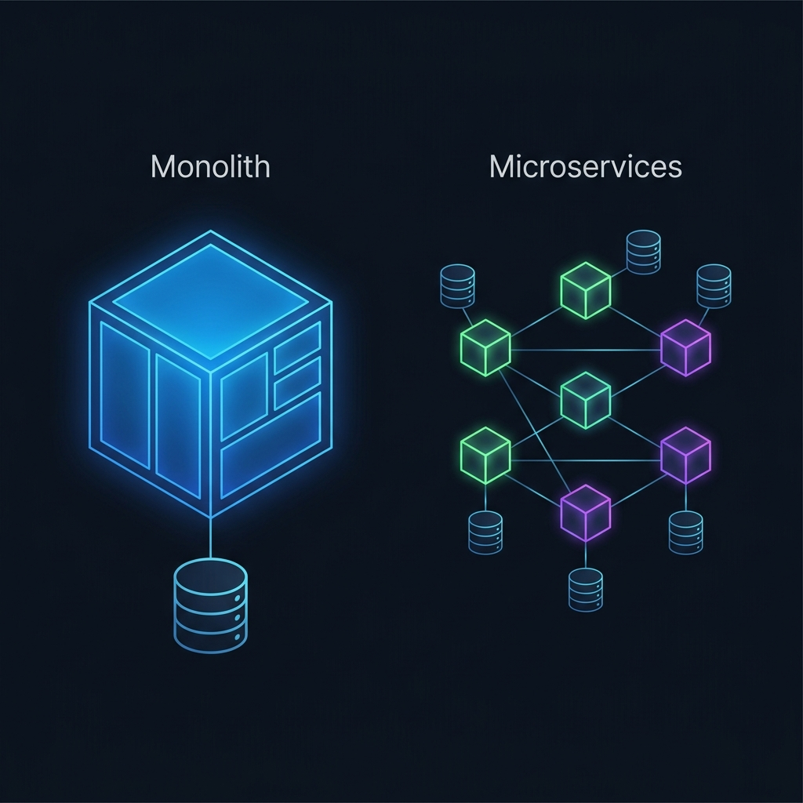
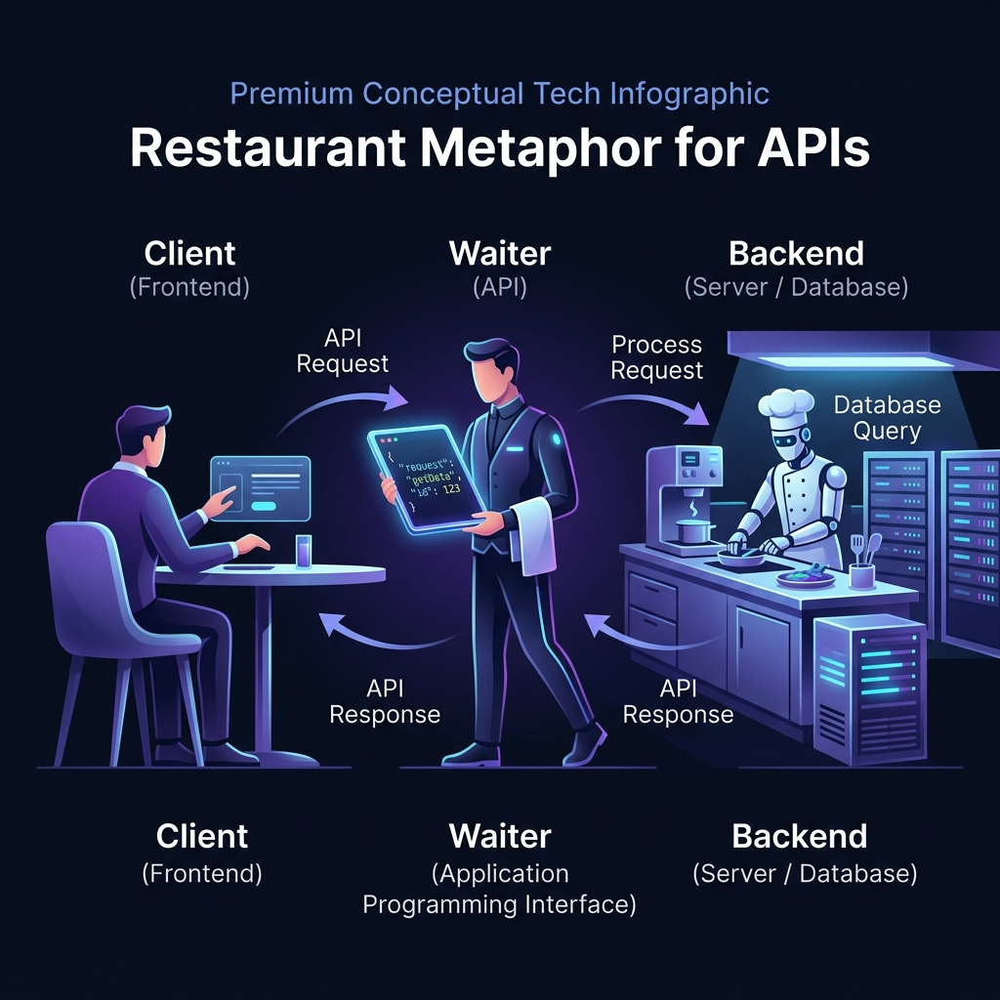
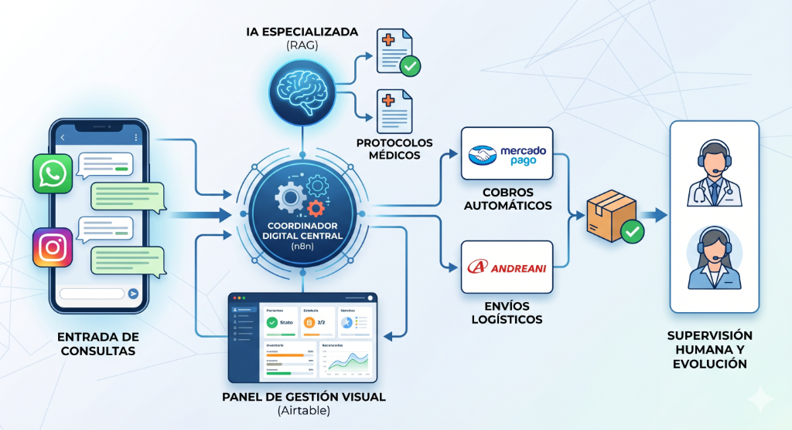

# 📚 Glosario de Re-Entry Tecnológico: Sesión 1 & Conceptos Clave IT

Este glosario ha sido diseñado especialmente para **Product Managers y Líderes de Producto** que necesitan cerrar la brecha entre la gestión tradicional de software (ERP, Waterfall, On-Premise) y el desarrollo moderno de software de alta velocidad (Cloud-Native, DevOps, IA Generativa, Arquitecturas Distribuidas).

Cada término incluye:
*   **Definición Técnica Simplificada**: El concepto real sin tecnicismos innecesarios.
*   **Metáfora / Ejemplo de la Vida Real**: Para anclar el conocimiento de forma intuitiva.
*   **Enfoque PM (¿Por qué te importa?)**: La implicancia estratégica de este concepto al gestionar equipos, priorizar backlogs y negociar con ingenieros.

---

## 🗺️ Bloque 1: El Cambio de Paradigma e IA Generativa (2012 vs. 2026)

### 1. Software Tradicional (Era Determinista)
*   **Definición**: Sistemas donde el comportamiento está 100% predefinido por reglas explícitas programadas por humanos. Si ocurre el evento `A`, el sistema ejecuta exactamente la acción `B`.
*   **Metáfora**: Una calculadora científica. No importa cuántas veces hagas `2 + 2`, siempre va a dar `4` de forma exacta porque sigue una regla cableada.
*   **Enfoque PM**: Permite predecir exactamente el comportamiento del sistema y definir casos de prueba claros de tipo *"Pasa / No pasa"*. Sin embargo, es rígido y no puede adaptarse a variaciones imprevistas o lenguaje natural sin un desarrollo complejo.

### 2. Software de IA (Era Probabilística)
*   **Definición**: Sistemas que procesan información utilizando modelos de lenguaje (LLM) o aprendizaje automático. No siguen reglas fijas redactadas a mano, sino que calculan la probabilidad estadística de cuál debería ser la mejor respuesta o acción basándose en sus datos de entrenamiento.
*   **Metáfora**: Un experto consultor humano. Si le hacés la misma pregunta tres veces, te va a responder de formas ligeramente diferentes pero con el mismo sentido, basándose en su experiencia previa.
*   **Enfoque PM**: Abre la puerta a automatizar tareas complejas (leer contratos, resumir reclamos, chatear con clientes en lenguaje natural). Pero tené en cuenta que introduce **variabilidad**: en lugar de esperar que el sistema ande siempre de forma idéntica, como PM tenés que gestionar márgenes de error aceptables, medir la precisión del modelo y controlar que la IA no invente datos (alucinaciones).

### 3. LLM (Large Language Model) como Servicio (API)
*   **Definición**: Un Modelo de Lenguaje Grande (como GPT-4, Claude o Gemini) alojado por un tercero (OpenAI, Anthropic, Google) al que el software de nuestra empresa consulta externamente a través de internet para procesar o generar texto.
*   **Metáfora**: Contratar un servicio de traducción externo por llamada telefónica en lugar de contratar traductores fijos en la oficina. Pagás por cada palabra traducida.
*   **Enfoque PM**: Permite integrar capacidades de IA superavanzadas en minutos sin necesidad de entrenar un modelo propio (lo cual costaría millones). La clave estratégica es controlar el costo por consumo (tokens) y el tiempo de respuesta (latencia) del proveedor externo.

### 4. Base de Datos Vectorial (Vector Database)
*   **Definición**: Una base de datos especializada en almacenar información convertida en vectores matemáticos (números). Esto permite buscar información no por coincidencia exacta de palabras clave, sino por **similitud conceptual** (búsqueda semántica).
*   **Metáfora**: Una biblioteca donde los libros no están ordenados alfabéticamente, sino por el "sentimiento" y la temática profunda del libro. Si buscás "perros", te va a traer libros sobre "mascotas leales" aunque no mencionen la palabra exacta "perro".
*   **Enfoque PM**: Es la pieza clave para implementar **RAG (Retrieval-Augmented Generation)**, permitiendo que un bot de IA responda preguntas usando únicamente el manual de procedimientos de tu empresa, evitando alucinaciones y protegiendo la privacidad de los datos.

### 5. Flujos Agénticos (AI Agents)
*   **Definición**: Sistemas donde la IA no solo responde preguntas, sino que tiene autonomía para planificar pasos, usar herramientas externas (como consultar una base de datos o enviar un email) y validar sus propios resultados para cumplir un objetivo complejo.
*   **Metáfora**: Un asistente personal al que le decís *"Reserva un pasaje para mi próximo viaje"*. El asistente busca opciones, compara precios, toma una decisión, compra el pasaje y te envía la confirmación.
*   **Enfoque PM**: Es lo último que se está usando hoy. Tu rol cambia de diseñar pantallas rígidas paso a paso (interfaces clásicas) a diseñar los **límites operacionales, permisos y criterios de éxito** de estos agentes autónomos.

---

## 🎨 Bloque 2: Arquitectura y Nube (La Infraestructura de Base)

### 6. Arquitectura Monolítica
*   **Definición**: Un patrón de diseño donde todo el sistema de software (frontend, backend, base de datos) se construye, empaqueta y despliega como **un único bloque de código** gigante e inseparable.
*   **Metáfora**: Un transatlántico gigante. Si necesitás cambiar un solo camarote de la sección C, tenés que meter todo el barco a dique seco y detener su operación por completo.
*   **Enfoque PM**: Era el estándar clásico (2012). Es fácil de construir al principio, pero con el tiempo se vuelve una pesadilla: un error en un módulo menor (por ejemplo, el carrito de compras) puede tirar abajo todo el sistema (incluyendo la facturación y la logística). Los despliegues son lentos, riesgosos y se hacen de madrugada.

### 7. Arquitectura de Microservicios
*   **Definición**: Un diseño donde una aplicación se divide en múltiples servicios pequeños, independientes y especializados, que se comunican entre sí a través de APIs. Cada microservicio tiene su propio código y, a veces, su propia base de datos.
*   **Metáfora**: Una flota de barcos pequeños navegando en formación. Si uno de los barcos sufre una avería, los demás siguen navegando y el sistema en general no deja de funcionar.
*   **Enfoque PM**: Es el estándar moderno (2026). Permite que diferentes equipos de desarrollo trabajen en paralelo de forma autónoma (un equipo maneja la sección de "Pagos", otro la de "Catálogo"). Los despliegues son rápidos e indoloros, evitando que un error tire todo el sistema.

### 8. On-Premise vs. Cloud Native (Nube Elástica)
*   **Definición**: 
    *   **On-Premise**: Alojar el software en servidores físicos propios instalados en las oficinas o centros de datos de la empresa.
    *   **Cloud Native**: Diseñar el software desde cero para que viva y aproveche los servicios elásticos de proveedores de nube (como AWS o Azure).
*   **Metáfora**: 
    *   *On-Premise*: Comprar un generador eléctrico de gasolina para tu oficina; vos te encargás del mantenimiento, el espacio físico y el combustible.
    *   *Cloud Native*: Conectarte a la red eléctrica general de la ciudad y pagar únicamente por los kilovatios consumidos.
*   **Enfoque PM**: El modelo Cloud Native elimina los costos fijos gigantescos de hardware (CAPEX) y los convierte en gastos operativos flexibles (OPEX), permitiendo escalar automáticamente según la demanda del negocio.
*   **On-Premise: ¿Cuándo Conviene?**:
    *   **Regulaciones de soberanía de datos estrictas**: En sectores como defensa, banca central o gubernamental, donde la ley exige físicamente que los datos residan en un edificio específico bajo control total.
    *   **Centros de datos ya amortizados**: Si la empresa ya posee una infraestructura gigante pagada y personal de operaciones propio inactivo.
*   **On-Premise: ¿Cuándo NO Conviene?**:
    *   **Necesidad de velocidad (Time-to-Market)**: Comprar, configurar y cablear un servidor nuevo puede tomar meses, retrasando cualquier lanzamiento de producto.
*   **Cloud Native: ¿Cuándo Conviene?**:
    *   **Negocios digitales ágiles**: Startups y apps que necesitan lanzar características semanalmente, experimentar rápido y escalar a millones de usuarios sin comprar hardware físico de antemano.
    *   **Tráfico variable**: Negocios con picos de tráfico estacionales (ej. Black Friday, CyberMonday). La nube enciende más capacidad al instante y la apaga después.
*   **Cloud Native: ¿Cuándo NO Conviene?**:
    *   **Costos de transferencia gigantescos**: Aplicaciones de uso masivo de datos continuo (ej. streaming a nivel petabyte o minería de criptomonedas sin control de salida) donde las tasas de "egress cost" de proveedores nube puedan disparar la factura mensual de forma incontrolable.

### 9. Serverless (Computación sin Servidor)
*   **Definición**: Un modelo de ejecución en la nube donde el desarrollador no tiene que configurar ni administrar servidores virtuales. Solo sube trozos de código (funciones) y el proveedor de la nube (como AWS Lambda) los ejecuta y cobra únicamente por los milisegundos en que ese código está corriendo.
*   **Metáfora**: Tomar un taxi. No comprás el auto, no pagás el seguro ni te preocupás por el estacionamiento; solo pagás por la distancia recorrida del punto A al punto B.
*   **Enfoque PM**: Reduce al mínimo absoluto los costos de infraestructura inactiva (si nadie usa la aplicación de noche, el costo es literalmente $0). Es excelente para APIs de bajo tráfico o tareas que se ejecutan esporádicamente en segundo plano.
*   **¿Cuándo Conviene?**:
    *   **Tráfico esporádico o variable**: Procesos que no corren de continuo (ej. generar reportes nocturnos, procesar imágenes que suben los usuarios, enviar correos programados). El costo baja a $0 en inactividad.
    *   **Prototipos rápidos (MVPs)**: Permite programar rápido y validar el producto sin perder tiempo configurando servidores ni pagando costos iniciales elevados.
    *   **Picos de carga inesperados**: La nube escala automáticamente de 1 a miles de peticiones simultáneas en segundos sin que tu equipo tenga que hacer nada.
*   **¿Cuándo NO Conviene?**:
    *   **Procesos largos o pesados**: Tareas que toman más de 15 minutos en ejecutarse (ej. procesar video pesado o entrenar modelos de IA). AWS Lambda y similares tienen límites de tiempo estrictos y se cortan.
    *   **Tráfico alto y constante**: Si tu servidor tiene miles de visitas ininterrumpidas las 24 horas, pagar por milisegundo de ejecución es muchísimo más costoso que alquilar un servidor tradicional dedicado encendido las 24 horas.
    *   **Arranque en frío (Cold Start)**: Si una función lleva tiempo sin usarse, la primera llamada tardará unos segundos extras en encender el contenedor interno que corre el código. Si tu app exige respuestas ultra-instantáneas, esto puede dañar la experiencia de usuario.

### 10. Docker (Contenedores)
*   **Definición**: Una plataforma que permite empaquetar una aplicación con todo lo que necesita para funcionar (código, librerías, configuraciones) dentro de una "caja virtual" llamada **contenedor**. Esto garantiza que la aplicación corra de la misma manera en cualquier computadora.
*   **Metáfora**: El contenedor de carga marítimo internacional. No importa si llevás ropa, juguetes o electrónicos; el contenedor tiene medidas estándar y encaja perfectamente en cualquier barco, camión o grúa del mundo.
*   **Enfoque PM**: Resuelve el clásico problema de los desarrolladores: *"En mi computadora andaba bien, no sé por qué falla en el servidor"*. Con Docker, garantizás que el sistema corra exactamente igual en la laptop del programador, en el servidor de pruebas y en producción, eliminando sorpresas en los lanzamientos.

### 11. AWS (Amazon Web Services)
*   **Definición**: La plataforma de computación en la nube de Amazon, que ofrece más de 200 servicios integrados, incluyendo bases de datos, potencia de cómputo, almacenamiento de archivos e Inteligencia Artificial. Es el líder global del mercado cloud.
*   **Metáfora**: Un centro comercial gigante de utilidades IT. En lugar de construir tu propio local en la calle, alquilás los espacios e infraestructura del centro comercial según lo necesitás.
*   **Enfoque PM**: Es la plataforma donde se construye y corre casi todo hoy en día. Conceptos como EC2 (servidores virtuales), S3 (almacenamiento de archivos) y RDS (bases de datos administradas) van a formar parte diaria de las charlas técnicas de tu equipo.

### 12. Nginx
*   **Definición**: Un servidor web de alto rendimiento y proxy inverso. Se encarga de recibir las peticiones de los usuarios en internet y distribuirlas eficientemente a los servidores de backend correspondientes. También actúa como una barrera de seguridad de entrada.
*   **Metáfora**: El recepcionista de un edificio corporativo. Organiza la fila de personas, pide identificaciones y les indica exactamente a qué oficina o piso deben dirigirse.
*   **Enfoque PM**: Cuando escuches al equipo hablar de *"configurar Nginx para balancear la carga"*, se refieren a organizar el tráfico para que tu producto no se caiga cuando miles de usuarios ingresen al mismo tiempo.

### 13. Ubuntu
*   **Definición**: Una de las distribuciones más populares de **Linux**, un sistema operativo de código abierto. Es el sistema preferido a nivel mundial para hacer funcionar servidores en la nube y contenedores Docker debido a su estabilidad y seguridad.
*   **Metáfora**: Los cimientos ocultos de un rascacielos. Los usuarios no los ven, pero sostienen toda la estructura de forma sólida e inquebrantable.
*   **Enfoque PM**: En el software moderno, Windows o macOS se usan para trabajar en la laptop personal, pero el software real (servidores de backend) corre casi en su totalidad sobre sistemas operativos basados en Linux como Ubuntu.

### 13b. Cron Jobs (Tareas Programadas)
*   **Definición**: Tareas automáticas en segundo plano que el sistema ejecuta a intervalos de tiempo o fechas específicas preconfiguradas (ej. cada hora, todos los días a las 2 AM, o el primer día de cada mes).
*   **Metáfora**: La alarma despertadora de tu celular. La programás una sola vez para que suene de lunes a viernes a las 7:00 AM, y el dispositivo se encarga de ejecutar esa acción recurrentemente sin intervención humana.
*   **Enfoque PM (El motor invisible del negocio)**: Son fundamentales para automatizar operaciones recurrentes (ej. cobrar suscripciones mensuales con Stripe, enviar recordatorios de carritos abandonados, limpiar la base de datos de registros temporales). Como PM, debés asegurarte de que el equipo configure alertas para saber de inmediato si un cron job crítico falla (por ejemplo, si no se procesa la facturación nocturna).
*   **¿Cuándo Conviene?**:
    *   **Procesamiento pesado fuera de hora pico**: Ideal para mover tareas intensivas (ej. generación de reportes masivos de ventas, sincronización de stock de ERP) a horarios nocturnos (ej. 3 AM) cuando no hay tráfico de usuarios activos.
    *   **Acciones periódicas obligatorias**: Tareas recurrentes fijas que deben ocurrir sí o sí (ej. renovar facturas cada día 1 de mes, generar backups diarios de la base de datos).
*   **¿Cuándo NO Conviene?**:
    *   **Acciones basadas en eventos en tiempo real**: Si necesitás que algo suceda inmediatamente cuando un usuario hace una acción (ej. enviar el recibo de compra al instante), no uses un cron job que corra cada hora; usá una arquitectura basada en eventos (*Webhooks* o colas de mensajería).
    *   **Sistemas sin monitoreo de fallas**: Si ponés procesos críticos en cron jobs pero no configurás logs y alertas de error (ej. Slack o correo si falla), el cron job puede romperse y pasarás semanas sin facturar a tus clientes sin enterarte.

---

## 🔌 Bloque 3: APIs e Integración (El Pegamento Digital)

### 14. API (Application Programming Interface)
*   **Definición**: Un conjunto de reglas y especificaciones que permite que dos aplicaciones de software independientes se comuniquen e intercambien datos de forma automatizada y segura.
*   **Metáfora**: El mozo de un restaurante. Vos (Cliente/Frontend) mirás la carta y le pedís un plato. El mozo lleva tu orden a la cocina (Backend), y regresa con el plato preparado para vos. Vos nunca entraste a la cocina ni tocaste los ingredientes.
*   **Enfoque PM**: Es el activo estratégico más valioso de un ecosistema moderno. Te permite conectar tu sistema con pasarelas de pago (Stripe), sistemas de envío (DHL), modelos de IA (OpenAI) o servicios internos sin tener que programarlos desde cero.

### 15. Endpoint
*   **Definición**: La dirección URL específica de una API a la cual un sistema debe apuntar para realizar una consulta o enviar información.
*   **Metáfora**: La ventanilla específica en una municipalidad. La ventanilla 1 es para "Pagos", la ventanilla 2 es para "Consultas de Deuda" y la ventanilla 3 es para "Registrar Nuevos Usuarios".
*   **Enfoque PM**: Al planificar un feature, vas a definir con el equipo técnico qué *endpoints* nuevos se necesitan. Por ejemplo, `https://api.tuempresa.com/v1/productos` para mostrar el catálogo.

### 16. Métodos HTTP (GET, POST, PUT, DELETE)
*   **Definición**: Las operaciones estándar que se pueden realizar sobre un endpoint de una API para indicar qué tipo de acción se desea ejecutar.
    *   **GET**: Solicitar o leer datos (Ej. ver la lista de productos).
    *   **POST**: Crear nuevos datos (Ej. registrar un nuevo usuario).
    *   **PUT**: Actualizar datos existentes (Ej. cambiar el precio de un producto).
    *   **DELETE**: Eliminar datos.
*   **Metáfora**: Los botones en un control remoto de TV. Cada botón le dice al televisor exactamente qué acción ejecutar sobre el canal seleccionado.
*   **Enfoque PM**: Ayuda a entender los diagramas técnicos de secuencia y a redactar criterios de aceptación claros. Ejemplo: *"Cuando el usuario presiona el botón 'Confirmar Compra', el frontend debe enviar una petición POST al endpoint `/ordenes`"*.

### 17. JSON (JavaScript Object Notation)
*   **Definición**: El formato estándar, ligero y basado en texto plano que utilizan las APIs modernas para estructurar y transferir datos entre sistemas. Es fácil de leer tanto por humanos como por computadoras.
*   **Metáfora**: Un formulario de solicitud estandarizado escrito a máquina, donde cada campo está claramente etiquetado en un formato común: `{"nombre": "Juan", "edad": 30}`.
*   **Enfoque PM**: Es la lengua franca de la web. Cuando depures integraciones con ingenieros o configures webhooks, vas a ver payloads JSON constantemente. Entender su estructura básica te da autonomía técnica inmediata.

### 18. XML (Extensible Markup Language)
*   **Definición**: Un formato de marcado de datos más antiguo, pesado y estricto que utiliza etiquetas personalizadas (similares a HTML) para estructurar la información: `<usuario><nombre>Juan</nombre></usuario>`.
*   **Metáfora**: Un contrato notarial antiguo y formal. Es extremadamente detallado y seguro, pero consume más papel y es más tedioso de leer rápidamente que un memo moderno.
*   **Enfoque PM**: Aunque JSON domina el mercado moderno, te va a tocar integrar sistemas corporativos heredados (Legacy) de finanzas, aduanas o grandes corporaciones tradicionales (como SAP o integraciones bancarias antiguas).

### 19. Modelo-Vista-Controlador (MVC)
*   **Definición**: Un patrón de arquitectura de software clásico que divide la lógica de una aplicación en tres partes independientes:
    *   **Modelo (Model)**: La base de datos y las reglas del negocio (los datos puros).
    *   **Vista (View)**: La interfaz visual que ve el usuario (el diseño, botones, pantallas).
    *   **Controlador (Controller)**: El cerebro intermedio que toma las acciones del usuario desde la Vista, procesa la información en el Modelo y decide qué mostrar de nuevo.
*   **Metáfora**: Un restaurante tradicional:
    *   *Modelo*: La despensa con los ingredientes y las recetas del chef.
    *   *Vista*: La mesa del comensal, el mantel y la presentación del plato.
    *   *Controlador*: El mozo que toma la orden del cliente (Vista), la lleva a la cocina para que preparen los ingredientes (Modelo) y les sirve la comida terminada.
*   **Enfoque PM**: Te permite entender cómo se estructuran las tareas de desarrollo. Un cambio visual solo afecta a la *Vista*, mientras que una nueva regla de facturación afectará al *Modelo*. Esto te ayuda a dimensionar el impacto de un cambio en el backlog.

---

## 🚢 Bloque 4: DevOps, CI/CD y Gestión de Ambientes (El Motor de Entrega)

### 20. CI/CD (Continuous Integration / Continuous Deployment)
*   **Definición**: Una práctica y conjunto de herramientas automatizadas que garantizan que cada cambio de código realizado por un programador sea compilado, probado de forma automática (CI) y desplegado al servidor de producción de forma segura y veloz (CD).
*   **Metáfora**: Una fábrica de ensamblaje de automóviles automatizada. Cada pieza que se añade pasa por escáneres láser automáticos de calidad. Si una pieza falla, la cinta se detiene al instante antes de que el auto defectuoso salga a la calle.
*   **Enfoque PM**: Es el corazón del delivery ágil. En lugar de esperar 3 meses para un gran lanzamiento riesgoso, CI/CD permite desplegar pequeñas mejoras constantes de forma segura todos los días sin interrumpir el servicio.

### 21. Ambientes de Trabajo (Dev vs. Staging vs. Prod)
*   **Definición**: Los servidores aislados donde se ejecuta la aplicación en diferentes etapas del ciclo de vida del desarrollo:
    *   **Dev (Desarrollo)**: El laboratorio inestable donde los programadores suben código crudo para experimentar.
    *   **Staging / Pre-Prod (Pruebas)**: Una réplica exacta del ambiente real para control de calidad y pruebas finales.
    *   **Prod (Producción)**: El servidor real donde están los clientes reales haciendo transacciones reales. Es sagrado.
*   **Metáfora**: 
    *   *Dev*: El boceto a lápiz en un block de notas.
    *   *Staging*: El prototipo del auto a escala real en la pista privada de pruebas de la fábrica.
    *   *Prod*: El auto circulando por la autopista pública con pasajeros a bordo.
*   **Enfoque PM**: Como PM, tu área de juego clave es **Staging**. Es allí donde realizás el testeo de aceptación final y firmás el alta para dar luz verde al despliegue en Producción (Sign-Off).

### 22. UAT (User Acceptance Testing) & Sign-Off
*   **Definición**: 
    *   **UAT**: El proceso final donde los usuarios de negocio o el Product Manager prueban la funcionalidad en Staging para verificar que cumple con los requerimientos acordados.
    *   **Sign-Off**: La firma o aprobación formal del PM que certifica que el feature está listo para salir a producción.
*   **Metáfora**: La prueba de manejo de un carro antes de salir de la concesionaria. Verificás que tenga las llaves, que encienda el aire y que el color sea el correcto.
*   **Enfoque PM**: Vos sos el guardián de esta puerta. Los programadores no deciden cuándo algo está comercialmente "terminado", lo decidís vos tras completar el UAT en Staging.

### 23. Feature Flags (Deploy vs. Release)
*   **Definición**: Variables de configuración que permiten "encender" o "apagar" una funcionalidad específica en el código de producción sin necesidad de volver a desplegar todo el sistema.
*   **Metáfora**: El interruptor de luz en una habitación. El cableado eléctrico (código) está instalado y energizado (Deploy), pero el cuarto permanece oscuro hasta que vos presionás el interruptor (Release).
*   **Enfoque PM**: **Diferencia fundamental**: *Deploy* es un acto técnico (subir el código al servidor de forma oculta); *Release* es un acto de negocio (hacerlo visible para los usuarios). Los Feature Flags te dan el poder como PM de decidir exactamente cuándo lanzar una función comercialmente sin presionar a los ingenieros el día de la fecha de entrega.

### 24. Canary Release (Despliegue Canary)
*   **Definición**: Una técnica de despliegue donde una nueva actualización se libera inicialmente a un grupo muy pequeño de usuarios reales (ej. el 5%) para verificar la estabilidad técnica antes de escalarlo al 100% de la base de usuarios.
*   **Metáfora**: Los antiguos mineros que bajaban un canario a la mina. Si el canario se desmayaba por gases tóxicos invisibles, los mineros salían de inmediato antes de verse afectados.
*   **Enfoque PM**: Reduce a cero el riesgo reputacional de un bug masivo en producción. Si la nueva versión tiene un fallo crítico, solo afecta a una fracción mínima de clientes y se puede revertir de inmediato sin que el 95% restante se entere.

### 25. Trunk-Based Development vs. GitFlow
*   **Definición**: 
    *   **GitFlow**: Estrategia tradicional donde se trabaja con muchas ramas intermedias y largas (`develop`, `release`, `hotfix`). Los desarrolladores integran su código con poca frecuencia.
    *   **Trunk-Based Development**: Práctica moderna donde los desarrolladores fusionan pequeños cambios de código diariamente en una única rama principal (`main` o `trunk`).
*   **Metáfora**: 
    *   *GitFlow*: Escribir un libro en silos y tratar de juntar todos los capítulos al final del año (unión caótica y propensa a errores).
    *   *Trunk-Based*: Escribir un documento de Google Docs colaborativo donde todos aportan párrafos cortos diariamente.
*   **Enfoque PM**: Trunk-Based reduce drásticamente los cuellos de botella y la latencia en las Pull Requests, haciendo que el pipeline fluya más rápido, pero requiere suites robustas de testing automatizado.

### 25b. Rollback vs. Hotfix
*   **Definición**:
    *   **Rollback**: Acción de devolver el servidor de producción a una versión de software anterior que sabemos que funcionaba perfectamente, anulando el último despliegue problemático.
    *   **Hotfix**: Un cambio de código menor y urgente desarrollado con máxima prioridad para solucionar un error crítico directamente en producción sin esperar al próximo ciclo de desarrollo.
*   **Metáfora**:
    *   *Rollback*: Deshacer la última actualización de tu app móvil que hizo que se cerrara sola (`Ctrl + Z`).
    *   *Hotfix*: Poner un parche rápido a una tubería que acaba de romperse en la pared para frenar la inundación.
*   **Enfoque PM**: Ante una crisis crítica en producción, el primer instinto del PM debe ser priorizar la estabilidad del cliente: evaluá si es más rápido hacer un Rollback inmediato (más seguro) o desarrollar un Hotfix (riesgoso si no se prueba bien).

### 25c. Post-Mortem (No punitivo / Causa Raíz)
*   **Definición**: Una reunión de análisis y documentación que se realiza después de resolver un incidente crítico en producción. Su objetivo es identificar la causa raíz del fallo y definir medidas de prevención definitivas, sin buscar culpables.
*   **Metáfora**: La investigación de la caja negra tras un incidente aéreo. No se busca castigar al piloto, sino entender por qué falló el sistema para evitar que vuelva a suceder en cualquier otro vuelo.
*   **Enfoque PM**: Como PM de Cargill re-ingresando al ecosistema IT, liderar estos análisis post-mortem de manera no punitiva fomenta una cultura de transparencia y mejora continua en el squad, mejorando la suite de pruebas del pipeline.

---

## 🛠️ Bloque 5: Testing y Calidad de Software (Asegurando el Valor)

### 26. Pruebas Unitarias, de Integración y End-to-End (E2E)
*   **Definición**:
    *   **Pruebas Unitarias (Unit Tests)**: Prueban una pequeña función matemática o bloque de código aislado.
    *   **Pruebas de Integración**: Prueban que dos o más módulos interactúen bien entre sí (Ej. que el módulo de pago hable bien con el módulo de inventario).
    *   **Pruebas End-to-End (E2E)**: Prueban el flujo completo del usuario simulando clics reales en una pantalla virtual desde el inicio hasta el fin.
*   **Metáfora**: Armar una bicicleta:
    *   *Unitario*: Probar que cada tornillo y rayo de la rueda esté en perfecto estado individualmente.
    *   *Integración*: Probar que la cadena encaje bien en el engranaje del pedal.
    *   *E2E*: Subirse a la bicicleta armada y pedalear 5 cuadras para asegurar que frena, gira y avanza correctamente.
*   **Enfoque PM**: Como PM, te sirve preguntar qué porcentaje del código tiene pruebas automáticas (**Test Coverage**). Si este número es muy bajo, cada cambio que suban a producción será una lotería y es muy probable que terminen rompiendo cosas que ya andaban (regresiones).

### 27. Postman (Pruebas de API)
*   **¿Qué es?**: Una herramienta interactiva de desarrollo y pruebas de software que permite a los desarrolladores y PMs enviar solicitudes a un endpoint de una API (hacer un GET o un POST) y visualizar la respuesta estructurada sin necesidad de construir una pantalla visual.
*   **¿Para qué sirve?**: Permite testear que la lógica del backend funciona correctamente mucho antes de que el equipo de diseño termine de crear la interfaz gráfica (Frontend).
*   **Guía rápida de uso para PMs**:
    1.  Abrís Postman y creás una nueva solicitud.
    2.  Seleccionás el método HTTP (ej. `GET`).
    3.  Pegás la dirección del endpoint (ej. `https://api.tuempresa.com/v1/productos`).
    4.  Presionás "Send".
    5.  **Análisis de la respuesta**: Revisás que el código de estado sea `200 OK` (éxito) y que el JSON resultante muestre los datos correctos de tus productos de forma ordenada.

### 27b. Herramientas de Testing y su Rol en el Proyecto
A continuación se listan las principales herramientas utilizadas en la industria y cómo se operan estratégicamente:

| Herramienta | Tipo de Prueba | ¿Cómo se usa en el proyecto? |
| :--- | :--- | :--- |
| **Postman** | Pruebas de API / Backend | Probar endpoints de forma manual o automatizada durante la fase de desarrollo para certificar que devuelven los datos correctos. |
| **Playwright / Selenium** | Automatización E2E (Frontend) | Escribir scripts (código) que abren un navegador web invisible, hacen clic en botones reales y completan formularios para asegurar que los flujos críticos del usuario (ej. Checkout) nunca se rompan. |
| **k6 / Apache JMeter** | Pruebas de Carga & Rendimiento | Simular miles de usuarios concurrentes navegando al mismo tiempo por la aplicación para identificar cuellos de botella en la nube y asegurar que el sistema no colapse bajo presión. |
| **Jest / JUnit** | Pruebas Unitarias (Código) | Suites que ejecutan automáticamente miles de pruebas en milisegundos sobre las funciones de código de bajo nivel de forma continua cada vez que un desarrollador edita un archivo. |
| **SonarQube** | Análisis Estático / Calidad | Un software que "lee" todo el código escrito por el equipo y busca vulnerabilidades de seguridad, malas prácticas de programación ("code smells") y duplicaciones de código, actuando como filtro de calidad. |

---

## 🌳 Bloque 6: Git, Control de Versiones y Branching

### 28. Diferencia entre Git y GitHub (El error común del PM)
*   **Git**: Es la herramienta de software local de control de versiones que instala cada programador en su computadora para llevar el registro histórico de los cambios realizados en el código (permite volver al pasado o crear ramas).
*   **GitHub**: Es una plataforma web en la nube (propiedad de Microsoft) que aloja los repositorios de Git y facilita la colaboración en equipo, revisiones de código, foros de discusión y pipelines de CI/CD. (Alternativas: GitLab, Bitbucket).
*   **Metáfora**:
    *   *Git* es la cámara de fotos profesional (la herramienta técnica local).
    *   *GitHub* es Instagram (la plataforma en la nube para compartir, organizar y colaborar sobre las fotos con otros).

### 29. Branching (Estrategia de Ramas)
*   **Definición**: La forma en que los desarrolladores organizan la creación de líneas de trabajo paralelas (ramas) sobre el código fuente para desarrollar características por separado sin interferir con el código estable que está en producción.
*   **Metáfora**: Escribir un libro colaborativo. En lugar de editar el archivo original todos al mismo tiempo (lo cual sería un caos), cada autor saca una fotocopia de un capítulo (Rama), hace sus ediciones en su casa y luego las unifica tras una revisión del editor principal (Merge).
*   **Enfoque PM**: La estrategia de branching define la velocidad de entrega del equipo. Las dos principales son: GitFlow (robusta pero lenta) y Trunk-Based Development (moderna, rápida, requiere excelente automatización).

### 30. Conceptos Críticos de Git Workflow
*   **Repository (Repo)**: El espacio central (local o en la nube) donde se guarda todo el código, historial y versiones del proyecto de software.
*   **Commit**: Guardar un cambio con una etiqueta descriptiva en el historial de Git (es como hacer un guardado rápido en un videojuego).
*   **Pull Request (PR)**: Una solicitud formal que hace un programador para integrar el código de su rama de trabajo individual a la rama principal del proyecto, invitando a otros desarrolladores a revisar su trabajo.
*   **Code Review**: La auditoría técnica donde un ingeniero lee el código escrito por otro en una PR para validar que cumpla estándares de calidad y no introduzca bugs antes de autorizar el merge.
*   **Merge**: La acción de fusionar dos ramas de código oficialmente (Ej. integrar la funcionalidad del carrito de compras a la versión principal del sitio).
*   **Git Clone**: Descargar por primera vez una copia completa de un repositorio desde la nube (GitHub) a la computadora local del desarrollador.
*   **Git Push**: Enviar los commits realizados localmente en la computadora del programador hacia el repositorio remoto en la nube (GitHub).
*   **Git Pull**: Descargar e integrar los últimos cambios que otros programadores han subido al repositorio remoto en la nube hacia la computadora local del desarrollador.

---

## 📊 Bloque 7: Bases de Datos (SQL vs. NoSQL)

La elección del tipo de base de datos define el rendimiento, la escalabilidad y la estructura de datos de tu producto tecnológico.

| Característica | SQL (Relacional) | NoSQL (No Relacional) |
| :--- | :--- | :--- |
| **Estructura** | Estricta y tabular (filas y columnas organizadas como una planilla Excel gigante). | Flexible y dinámica (organizada como documentos JSON, grafos o clave-valor). |
| **Esquema** | Definido y rígido. Tenés que saber de antemano exactamente qué datos vas a guardar. | Dinámico y adaptable. Podés guardar datos diferentes en cada registro sin avisar. |
| **Relaciones** | Excelente para cruzar tablas complejas de forma matemática (Ej. Cruce de Clientes con Órdenes y Facturación). | Pobre para relaciones complejas. Se prefiere duplicar datos para agilizar lecturas. |
| **Escalabilidad** | Principalmente **Vertical** (requiere comprar servidores con más memoria RAM/procesador). | Principalmente **Horizontal** (se escala añadiendo más servidores estándar y distribuyendo los datos). |
| **Ejemplos** | PostgreSQL, MySQL, SQL Server, Oracle. | MongoDB, DynamoDB, Redis, Cassandra. |
| **¿Cuándo usar?** | Sistemas de transacciones financieras, ERPs, CRMs donde la precisión de los datos y las relaciones rígidas son vitales. | Aplicaciones móviles de alto tráfico, feeds de redes sociales, catálogos de e-commerce dinámicos o procesamiento de logs de sensores. |

---

## 🏃 Bloque 8: Metodología Agile y Scrum (El Motor Organizacional)

### 31. User Stories (Historias de Usuario)
*   **Definición**: Una explicación sencilla e informal de una funcionalidad del software, escrita desde la perspectiva del usuario final. Sigue el formato estándar:
    > *"Como [tipo de usuario], quiero [realizar una acción] para poder [obtener un beneficio/valor]."*
*   **Metáfora**: Un recordatorio de compra que especifica el propósito de lo que vas a adquirir en lugar de una lista rígida de especificaciones físicas.
*   **Enfoque PM**: Es tu herramienta principal para alinear al equipo en el **por qué** y el **qué** antes de entrar en los detalles técnicos de la programación. Deben acompañarse siempre de **Criterios de Aceptación** claros (el contrato que define si el trabajo está completado).

### 32. Epics (Épicas)
*   **Definición**: Un bloque de trabajo grande y estratégico que abarca múltiples historias de usuario y que no se puede completar en un solo Sprint de trabajo.
*   **Metáfora**: El capítulo completo de un libro que contiene múltiples páginas y escenas individuales.
*   **Enfoque PM**: Te ayuda a estructurar tu roadmap de producto a alto nivel. Por ejemplo, la épica *"Implementar Pasarela de Pagos LatAm"* contendrá historias de usuario específicas para pagos con tarjeta, transferencias locales y reembolsos.

### 33. Ceremonias e Instrumentos Clave de Scrum
*   **Product Backlog**: La lista maestra priorizada de todas las funcionalidades, mejoras, bugs e iniciativas que el producto necesita a largo plazo. Es propiedad exclusiva del PM/PO.
*   **Sprint**: Un contenedor de tiempo fijo (usualmente de 2 semanas) durante el cual el equipo de desarrollo se compromete a entregar un incremento de software utilizable y de valor.
*   **Daily Scrum (La Diaria)**: Una reunión corta de 15 minutos diaria para alinear al equipo técnico, revisar el avance del Sprint Backlog e identificar bloqueantes de cara al objetivo del sprint.
*   **Sprint Planning**: La sesión de planificación al inicio de cada Sprint donde el PO presenta los elementos prioritarios del backlog y el equipo de desarrollo selecciona y estima qué puede entregar en las siguientes dos semanas.
*   **Sprint Review**: La demostración interactiva al final del Sprint donde el equipo muestra el incremento de software real y funcional a los stakeholders para obtener retroalimentación directa.
*   **Sprint Retrospective**: La reunión final de mejora continua donde el equipo analiza de forma interna qué funcionó bien, qué falló a nivel de procesos y cómo optimizar la dinámica de trabajo para el siguiente sprint.
*   **Velocity (Velocidad)**: La métrica histórica que calcula cuántos puntos de historia (Story Points) promedio puede completar de forma de estable el equipo de desarrollo durante un solo Sprint. Ayuda al PM a realizar proyecciones realistas del roadmap de mediano plazo.

---

## 👥 Bloque 9: Roles en Equipos de Software (Estructuras de Trabajo)

### 34. Full-Stack Developer
*   **Definición**: Un programador generalista con habilidades para desarrollar tanto la interfaz visual del cliente (Frontend) como la lógica interna del servidor y la base de datos (Backend).
*   **Enfoque PM**: Es el rol multitask clásico en Startups. Te da gran velocidad para iterar prototipos, pero para sistemas corporativos altamente escalables vas a necesitar desarrolladores especializados de Frontend y Backend.

### 35. PM vs. PO (Product Manager vs. Product Owner)
*   **Definición**:
    *   **Product Manager (PM)**: Rol orientado al negocio, la visión estratégica de mercado, la viabilidad financiera (ROI) y el descubrimiento de producto (Product Discovery).
    *   **Product Owner (PO)**: Rol táctico en el squad de desarrollo, encargado de refinar historias de usuario, priorizar la cola de trabajo diaria (Backlog), responder dudas de los ingenieros y liderar el sprint.
*   **Metáfora**: El PM es el arquitecto que analiza el terreno, el mercado de viviendas y diseña el concepto general del edificio; el PO es el capataz de la obra que está diariamente con los obreros asegurándose de que los ladrillos se coloquen bien y a tiempo.
*   **Enfoque PM**: En organizaciones maduras, estos roles se desdoblan para evitar que el PM colapse por el micro-management del día a día técnico.

### 36. Tech Lead (Líder Técnico)
*   **Definición**: El desarrollador más experimentado del equipo que toma las decisiones de arquitectura de software, define estándares de código y actúa como el puente principal de comunicación técnica entre el PO y el equipo de ingenieros.
*   **Enfoque PM**: Tu socio estratégico principal. No te comprometas con fechas de entrega ni diseñes soluciones técnicas sin antes validarlas y co-diseñarlas con tu Tech Lead.

### 37. DevOps Engineer
*   **Definición**: Un especialista dedicado exclusivamente a automatizar y mantener la infraestructura en la nube, los servidores, los pipelines de CI/CD y asegurar la estabilidad de los despliegues.
*   **Enfoque PM**: Si los desarrolladores hacen "las luces y los muebles" de la casa, el DevOps hace "las tuberías y el cableado eléctrico". Son vitales para mantener el sistema online 24/7.

---

## 💡 Las 3 Preguntas de Control Clave para tus Reuniones Técnicas

Como PM en proceso de reingreso al mercado IT moderno, grabate estas tres preguntas. Si las formulás en tus comités de diseño o durante una entrevista, te vas a posicionar de inmediato como un líder con excelente criterio técnico contemporáneo:

1.  **Sobre Branching y Despliegues**:
    > *"¿Cómo es el Git workflow del equipo? ¿Se trabaja con GitFlow tradicional o estamos implementando una estrategia de Trunk-Based Development para reducir la latencia de las Pull Requests?"*
2.  **Sobre Calidad y Automatización**:
    > *"¿Qué nivel de cobertura de pruebas automatizadas tenemos implementado en el pipeline de CI antes de autorizar el merge a Staging para evitar regresiones?"*
3.  **Sobre Microservicios y API Governance**:
    > *"Dado que nuestra arquitectura modular de microservicios está creciendo, ¿cómo estamos gestionando la documentación (ej. Swagger/OpenAPI) y el versionado de nuestras APIs internas para evitar romper dependencias?"*
