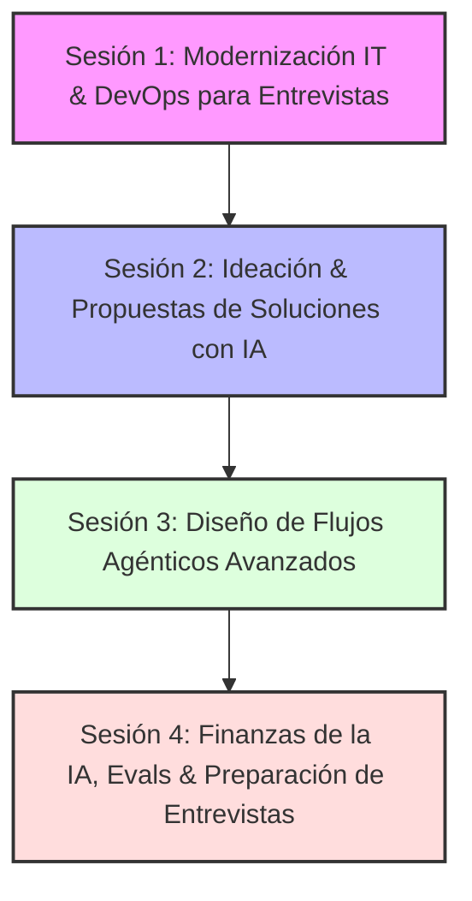

# Programa de Mentoría IT & IA para Project Management
## Propuesta Consolidada de 4 Sesiones: Enfoque "Re-entry & Posicionamiento IT/IA"

Esta propuesta está totalmente diseñada para el estudiante que busca reingresar al mercado de IT como Project Manager tras haberse desempeñado en áreas de negocio tradicionales (como su trayectoria en Cargill). El foco absoluto del programa consiste en **cerrar la brecha temporal, actualizar su vocabulario técnico y armar un portafolio de casos de estudio de IA** para destacar en entrevistas de selección.

---

## 🗺️ Mapa de Ruta del Programa

El temario guía al estudiante en un viaje de aceleración profesional, combinando los conceptos más modernos de ingeniería de software con la arquitectura de inteligencia artificial aplicada.

---

## 📘 Detalle del Temario de 4 Sesiones

### 1️⃣ Sesión 1: Modernización IT, DevOps y Dinámicas de Equipos de Software
*Cerrando la brecha de 10 años: del waterfall y monolitos a la agilidad cloud moderna.*

* **Objetivo de la sesión**: Que el estudiante recupere la confianza técnica, comprenda cómo se produce software hoy en día y aprenda a hablar el mismo idioma que los equipos ágiles modernos en entrevistas.
* **Conceptos clave a cubrir**:
  * **La evolución de la arquitectura**: De las aplicaciones monolíticas tradicionales a los Microservicios modernos, APIs (REST, GraphQL) y servicios en la nube.
  * **DevOps & Despliegue Moderno**: Qué es un pipeline de CI/CD. Gestión de ambientes (Dev, Staging, Prod). Estrategias de control de código (Git Branching, Pull Requests).
  * **El rol del PM en el día a día moderno**: Cómo liderar ceremonias ágiles (Sprints, Dailies, Plannings) en equipos que despliegan código múltiples veces al día.
* **🎯 Enfoque de Posicionamiento / Portafolio**: 
  * Cómo traducir los años de experiencia como PM tradicional en competencias de gestión ágil.
  * Vocabulario técnico clave para sonar actualizado frente a reclutadores de IT.

---

### 2️⃣ Sesión 2: Fundamentos de IA, RAG y Estructuración de Propuestas de Negocio
*Cómo identificar oportunidades de IA y armar propuestas de valor para empresas tradicionales.*

* **Objetivo de la sesión**: Desmitificar la inteligencia artificial generativa y enseñar a estructurar y proponer soluciones de IA concretas para optimizar procesos de negocio corporativos (aprovechando la experiencia en industrias tradicionales).
* **Conceptos clave a cubrir**:
  * **LLMs y Contexto**: Entendimiento de Tokens (costos), Ventana de Contexto (límites de memoria) y Prompt Engineering para PMs.
  * **RAG (Retrieval-Augmented Generation)**: Cómo conectar de forma segura los datos privados de una empresa con un LLM sin incurrir en entrenamientos de modelos costosos.
  * **Bases Vectoriales & Cloud**: Dónde se almacena y procesa esta información de manera segura (búsqueda semántica).
* **🎯 Enfoque de Posicionamiento / Portafolio**:
  * **Creación de un "Mock PRD" (Product Requirement Document)**: Diseñar en conjunto una especificación de producto para una funcionalidad de IA. Este documento servirá como portafolio tangible en entrevistas para demostrar solidez en la especificación de soluciones de IA.

---

### 3️⃣ Sesión 3: Flujos Agénticos Avanzados y Casos de Uso Corporativos
*Diseño de procesos automatizados inteligentes con agentes autónomos.*

* **Objetivo de la sesión**: Elevar el conocimiento técnico al nivel más alto del mercado actual: aprender a diseñar sistemas de IA que no solo responden preguntas, sino que actúan como agentes autónomos que resuelven flujos complejos.
* **Conceptos clave a cubrir**:
  * **Sistemas Agénticos**: Qué es un agente de IA. Patrones de diseño fundamentales (Routing, Orchestrator-Workers, RAG agéntico).
  * **Human-in-the-loop**: Cómo y dónde incluir supervisión humana para evitar fallas graves en flujos de producción.
  * **Gestión de Limitaciones**: Manejo de alucinaciones y control de calidad del output mediante validadores estructurados (JSON/Pydantic).
* **🎯 Enfoque de Posicionamiento / Portafolio**:
  * **Caso de estudio agéntico**: Diseñar el flujo agéntico para un caso de uso conocido (por ejemplo, logística, cadena de suministro o análisis de contratos). Esto proporcionará un discurso de entrevista altamente competitivo.

---

### 4️⃣ Sesión 4: Finanzas de la IA (Economics), Evals y Simulación de Entrevistas
*Viabilidad del negocio, medición de calidad y preparación para el mercado laboral.*

* **Objetivo de la sesión**: Proporcionar las herramientas finales para defender presupuestos de IA, garantizar la calidad de software probabilístico y simular entrevistas reales para el reingreso al mercado IT.
* **Conceptos clave a cubrir**:
  * **Economics & Costos de IA**: Cómo calcular el ROI de una funcionalidad de IA. Costo por tokens, prompt caching, RAG vs. Fine-tuning.
  * **Seguridad y Privacidad corporativa**: Mitigación de fuga de datos corporativos (Data Leakage) y normativas de privacidad (GDPR, etc.).
  * **Evaluación de IA (Evals)**: Cómo probar un sistema de software donde el resultado final cambia constantemente (LLM-as-a-judge) y herramientas de observabilidad en producción (Langfuse, Arize).
* **🎯 Enfoque de Posicionamiento / Portafolio**:
  * **Simulación de Entrevista de PM IT/IA**: Realizar un juego de rol donde el mentor actúa como reclutador técnico o hiring manager y plantea preguntas estratégicas sobre cómo liderar un equipo de desarrollo de IA, cómo gestionar un desvío de presupuesto de tokens o cómo resolver la latencia en llamadas a la API de OpenAI.

---

## 📅 Dinámica de Trabajo Recomendada (1 vez por semana)

Dada la situación de búsqueda activa de empleo, mantener la frecuencia de **1 sesión por semana** es lo óptimo, estructurando el ciclo semanal de la siguiente manera:

* 📅 **Día de la Sesión (1 hora)**: Clases técnico-estratégicas altamente orientadas a entrevistas y resolución de casos de estudio.
* 📩 **Día +1 (Post-sesión)**: Además de la grabación de la clase, se envían **"Plantillas de Entrevista"** o **"Preguntas Frecuentes de Contratación"** relacionadas con la temática abordada.
* 💬 **Día +3 (Mid-week check-in)**: Se propone una tarea corta de portafolio. Por ejemplo: *"Se adjunta una consigna breve para optimizar el Mock PRD iniciado en la sesión. Resultará de gran utilidad para incluir en el CV o perfil de LinkedIn."*
* 🚀 **Día -1 (Pre-calentamiento)**: Se envían lecturas sugeridas rápidas para familiarizarse con la cultura IT moderna.
